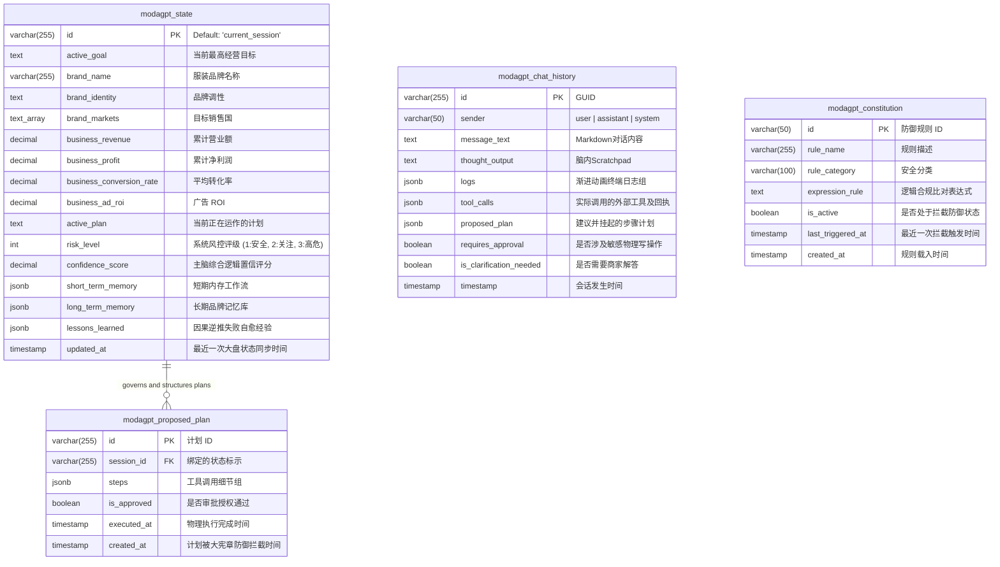

# ERD: ModaGPT Stateful Cognitive Loop Runtime

本图表和文档描述了 ModaGPT Stateful Cognitive Loop Runtime 在数据库中的 ERD 关系、实体完整性以及外键约束和生命周期。

---

## 关系约束与生命周期描述

1. **`modagpt_state` 与 `modagpt_proposed_plan` (一对多 `1 : N`):**
   - 一个会话大盘状态可以多次生成新的计划。由于 `modagpt_proposed_plan` 的 `session_id` 始终默认为 `'current_session'`，它完美锁定了当前会话挂起和授权的所有步骤历史，支持撤销、重试与自愈。

2. **`modagpt_chat_history`:**
   - 包含多轮次问答历史，其中最后一轮助理发言可能附带 `proposed_plan` 数组和 `requires_approval = TRUE` 指标，用于在 UI 渲染一键审批通过。

3. **`modagpt_constitution` (宪法规则库):**
   - 它是主脑执行计划（`modagpt_proposed_plan`）进行物理调用前的硬隔离红线。若计划中的某一步骤被判定触发不合规（如定价违反毛利率红线），会在 `modagpt_constitution` 记录 `last_triggered_at` 拦截事实，并将该轮消息标记为未授权阻断。
